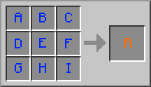

Форменный рецепт – это рецепт в котором учитывается положение предметов в сетке крафта. Такими рецептами являются: стол зачарований, кирка, меч и т.п. Для добавления такого рецепта воспользуемся методом GameRegistry#addShapedRecipe().
Схема аргументов данного метода выглядит следующим образом:
`GameRegistry.addShapedRecipe(<R>, "ABC", "DEF", "GHI", <ingredients...>);`


```java
public class ModRecipes {
    public static void registerRecipes() {
        GameRegistry.addShapedRecipe(new ItemStack(ModItems.RUBY_SWORD),
                " R ", " R ", " S ",
                'R', ModItems.RUBY,
                'S', Items.stick);
    }
}
```

Бесформенный рецепт – это рецепт в котором не учитывается расположение предметов в сетке крафта. Проще говоря, это рецепт смешивания предметов. Такими рецептами являются: огниво, око эндера, книга и т.п. Для добавления такого рецепта воспользуемся методом `GameRegistry#addShapelessRecipe()`. Этот метод намного проще в использовании, чем форменный рецепт – здесь указывается только результат и перечисление ингредиентов. Здесь всё также можно передавать `Block`, `Item` и `ItemStack` в качестве них.
```java
public class ModRecipes {
    public static void registerRecipes() {
        // ...

        for (int damage = 0; damage < 15; damage++) {
            GameRegistry.addShapelessRecipe(new ItemStack(ModItems.BALLOON, 1, damage), new ItemStack(Blocks.wool, 1, ~damage & 15), Items.string);
        }
    }
}
```

Для добавления рецепта в печь используется три метода:

`GameRegistry#addSmelting(Block, ItemStack, float)`

`GameRegistry#addSmelting(Item, ItemStack, float)`

`GameRegistry#addSmelting(ItemStack, ItemStack, float)`

Первым параметром является исходный предмет/блок для плавки, вторым результат плавки, а третьим кол-во опыта получаемого при плавлении предмета/блок. Первые два метода предназначены для упрощённого добавления рецепта `ItemStack` с указанием **wildcard damage**.

```java
public class ModRecipes {
    public static void registerRecipes() {
        // ...

        GameRegistry.addSmelting(ModBlocks.RUBY_ORE, new ItemStack(ModItems.RUBY), 5F);
    }
}
```